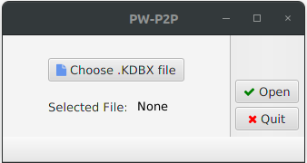
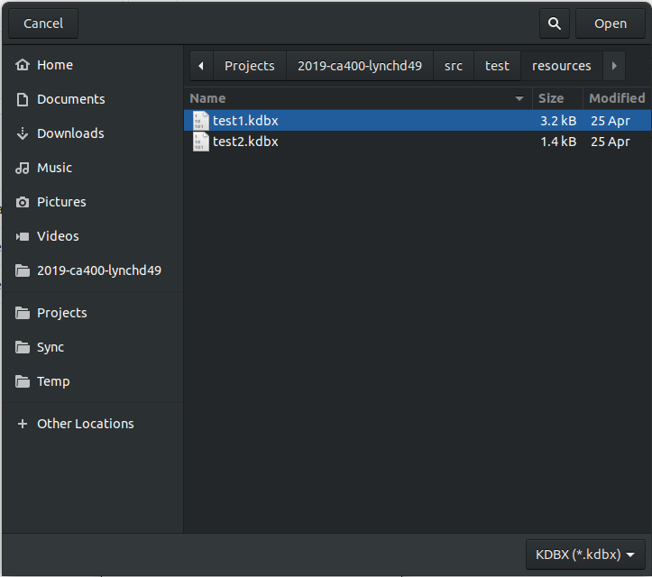
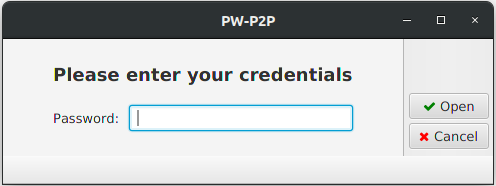
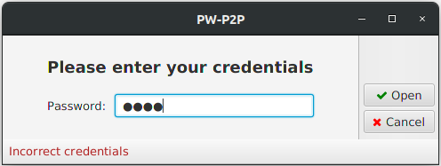
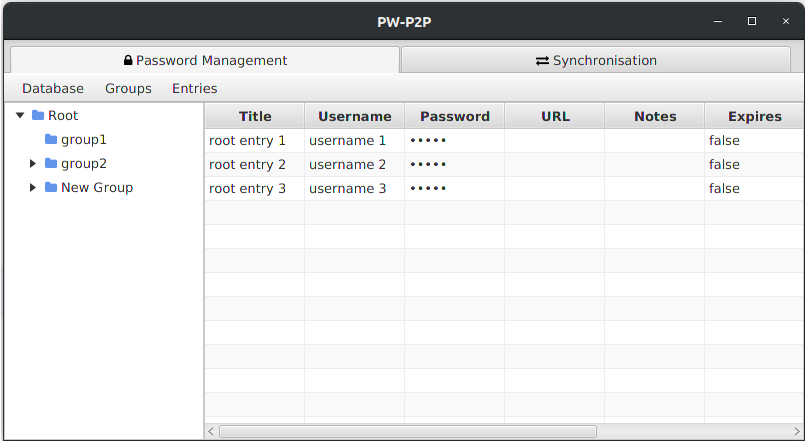
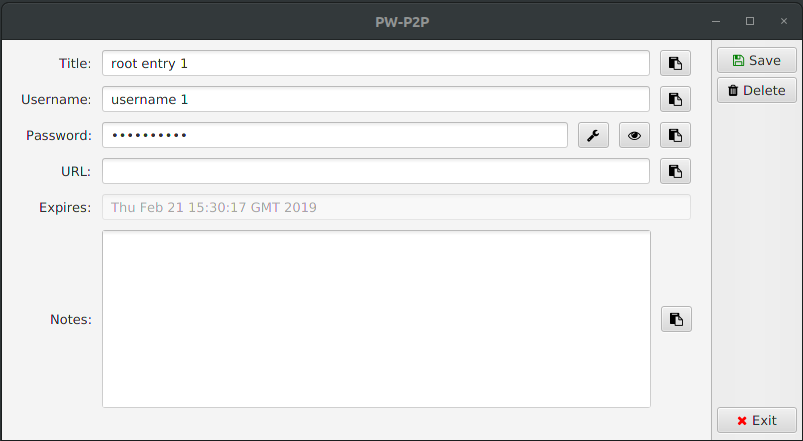
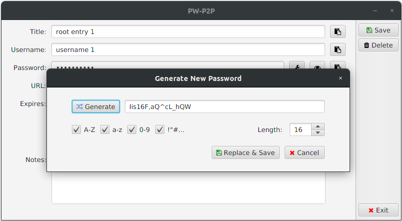
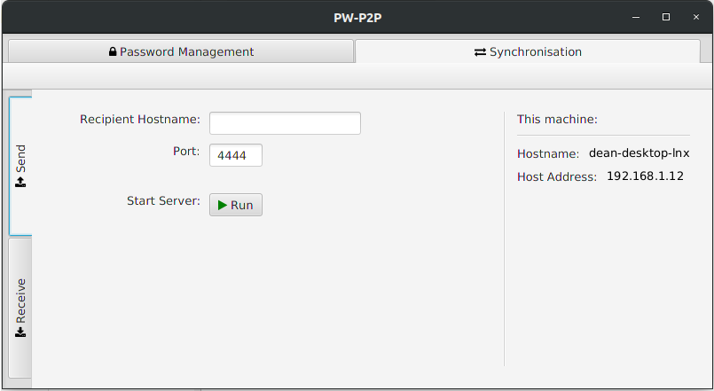
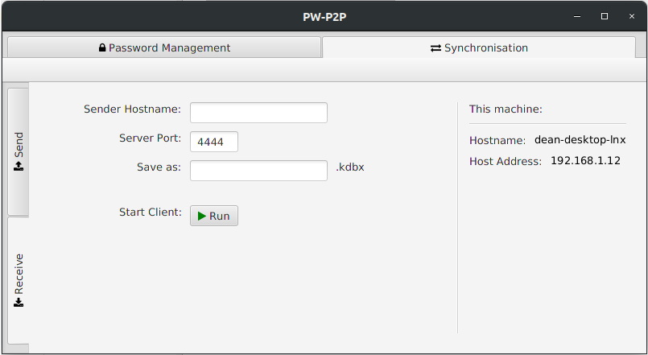

 

# Password Manager with P2P Synchronisation
## User Manual
###### Dean Lynch
###### 15359921
###### 16/05/19

### Table of Contents
* [1. Requirements](#1-requirements)
* [2. Page Walk-through](#2-page-walk-through)
    * [2.1 File Selection](#21-file-selection)
    * [2.2 Credentials Entry](#22-credentials-entry)
    * [2.3 Password Management](#23-password-management)
    * [2.4 Entry View](#24-entry-view)
    * [2.5 Synchronisation](#25-synchronisation)
* [3. Functionality Walk-through](#3-functionality-walk-through)
    * [3.1 Selecting a database](#31-selecting-a-database)
    * [3.2 Entering Credentials](#32-entering-credentials)
    * [3.3 Creating a new Entry](#33-creating-a-new-entry)
    * [3.4 Editing an Entry](#34-editing-an-entry)
    * [3.5 Generating a new password for an Entry](#35-generating-a-new-password-for-an-entry)
    * [3.6 Deleting an Entry](#36-deleting-an-entry)
    * [3.7 Creating a new Group](#37-creating-a-new-group)
    * [3.8 Editing a Group](#38-editing-a-new-group)
    * [3.9 Deleting a Group](#39-deleting-a-group)
    * [3.10 Copying a password to the clipboard](#310-copying-a-password-to-the-clipboard)
    * [3.11 Sending database to another device](#311-sending-database-to-another-device)
    * [3.12 Receiving database from another device](#312-receiving-database-from-another-device)

### 1. Requirements
* **Operating system:** 
    * Linux (Tested on Ubuntu 18.04 LTS)
    * Windows (Tested on Windows 7 & 10, compatibility with previous
    versions has not been tested.
    * Mac OS (Warning - Not tested!)

* **Java version:** 
    * 11.02 LTS or later

### 2. Page Walk-through

##### 2.1 File Selection
The file selection page is the first page that you will see when the 
application is launched.

1. **Choose file button:**
* The choose file button will open the operating systems built in file 
explorer (Example shows file navigation in Ubuntu), 
and will ask you to select a .KDBX file to open.
* Choosing a file will automatically bring you to the 
[credentials entry](#22-credentials-entry) page.

2. **Current selected file**
* Once a file has been selected successfully, this will display the 
name of the selected .kdbx file.

3. **Open & quit buttons**
* Once a file is selected, the open button will allow you to 
proceed to the [credentials entry](#22-credentials-entry) page. 
* The quit button will close the application.

| **File Selection** | **File Explorer** |
| :-------------: | :-------------: |
|  |  

##### 2.2 Credentials Entry
Once a .kdbx file has been successfully selected, you will be brought 
to the credentials entry page.
Here you can enter the credentials to their database in order to view 
their saved password entries.

A status message will be displayed in the footer of the page if incorrect 
credentials have been entered.

| **Credentials Entry** | **Incorrect credentials warning** |
| :-------------: | :-------------: |
|  |  |

##### 2.3 Password Management
This is the main page of the application. 
Here you can navigate and manage their password groups and entries.

1. **Tabs:**
* Using the tabs, you can easily switch between the password management page
and the [synchronisation page](#24-synchronisation).

2. **Toolbar:**
* The toolbar allows you to manage the database, groups and entries.

3. **Tree View:**
* The expanding tree view on the left hand side of the application allows you 
to navigate through the group structure of the database. 
* When you click on a group in the tree view, the corresponding group will 
be displayed in the table view to the right of the tree view.
* If a group has child folders (indicated by an arrow to the left of the folder icon),
 double clicking on the group will expand/collapse the group in the tree view.

4. **Table View:**
* The table view, which is located to the right of the tree view, displays
all of the password entries located inside of the currently selected group.
* At a quick glance you can see each of the details associated with each entry.
* Sensitive information (your password) is hidden from view here to prevent
it being compromised by people in your surroundings from glancing from behind your back!
* Double clicking on a row in the table will bring you the the 
[entry view page](#24-entry-view) for that particular entry.

| **Password Management** |
| :-------------: |
|  |

##### 2.4 Entry View

Here you can view, manage and edit a particular password entry.
1. **Copy to clipboard**
* By clicking on the clipboard icon next to one of the text fields,
the contents from the entry will copied to your clipboard.
2. **Toggle visibility**
* This is exclusively for the password field.
* Clicking on the eye icon will toggle the visibility 
of the password between plaintext and obscured bullet characters.
3. **Password Generation**
* This is exclusively for the password field.
* Clicking on the wrench icon will open a new dialog box, giving you the 
option to generate a new password for the entry.
* In the dialog, you have a few options to customise the generated password
to suit certain requirements for different websites and applications:
    * **Length:** Choose the length of the generated password.
    * **Uppercase characters (A-Z):** Select this checkbox to use upper case letters
    in the generated password
    * **Lowercase characters (a-z):** Select this checkbox to use lower case letters
    in the generated password
    * **Numbers (0-9):** Select this checkbox to use numbers in the generated password
    * **Special Characters (!"#...):** Select this checkbox to use special characters
    in the generated password
* **Save Button:** Clicking the save button will save the entry in its current
state as shown in the text fields. Any changes made in the text fields will
be applied to the entry once it has been saved.
* **Delete Button:** Clicking the delete button will first prompt you asking 
if you want to continue with this action, before removing the entry from the 
database any returning you to the [password management page.](#23-password-management)
* **Exit Button:** Clicking the exit button will return you to the 
[password management page](#23-password-management) without applying any
changes made since the entry has last been saved.

| **Entry View** | **Password Generation** |
| :-------------: | :-------------: |
|  |  |

##### 2.5 Synchronisation
On this page you can send and receive .kdbx files from other devices. You 
can switch between sending and receiving by choosing one of the two options
found in the tabs at the left hand side of the page.

**Instructions for sending/receiving:**

The information about your current machine can be found on the right hand 
side of the page from both the send and receive tabs. This includes the 
machines hostname and host address.

* **_Important!_**
    * To make the receiving process more resourceful, the receiving client 
    will not wait to find the specified server if it isn't found on the first attempt.
    * The process will stop immediately and wait for you to run it again. 
    * For this reason, you should start sending process on the device you 
    are sending from first before you start the receiving process on the 
    device you want to receive the .kdbx file on. 

**Sending:**
To send a .kdbx file:
1. Click on the 'Send' tab on the left hand side of the page.
2. Enter the receiving devices hostname or host address. *(e.g. 192.168.1.16)* 
3. Enter the port on which you want the process to run on.
4. Click on the run button.
5. A prompt will appear that the server is running and waiting for the receiving
device to connect. You may stop the process at any time by clicking on the 
'Stop Server' button.
5. After the receiving device connects, you will then be shown a dialog indicating whether
the transfer has been successful or not.

**Receiving:**
To receive a .kdbx file:
1. Click on the 'Receive' tab on the left hand side of the page.
2. Enter the sending devices hostname or host address.  *(e.g. 192.168.1.16)*
3. Enter the port that the sending devices server is running on. 
*(i.e. The same port number entered when starting the server)*
4. Enter what name you want the received file to be saved under.
5. Click on the run button.
6. If the server isn't found, a prompt will appear and the process will end.
You will then have to ensure tha the sending device's server is running before 
clicking the run button again.
7. If the server is found, you will then be shown a dialog indicating whether 
the file has been received successfully or not.

| **Synchronisation - Send** | **Synchronisation - Receive** |
| :-------------: | :-------------: |
|  |  |

### 3. Functionality Walk-through
##### 3.1 Selecting a database
1. Start the application
2. Click the 'Choose .KDBX file' button.
3. Select a .kdbx file using the operating systems file explorer.
4. The selected file's name will appear under the 'Choose .KDBX file' button.
5. If you are not automatically sent to the credentials page, or have returned 
back from the credentials page, click on the 'Open' button.

##### 3.2 Entering Credentials
*Continuing from 3.1 above*
1. Enter the database credentials.
2. Hit the enter key, or press the 'Open' button.
3. You will be shown the password management page, unless the credentials 
entered are incorrect, in which case a warning message will be displayed notifying
you of this.

##### 3.3 Creating a new Entry
1. Go to the password management page.
2. Using the tree view, select the group in which you would like to create a new 
entry in.
3. In the toolbar select 'Entries -> New Entry'. 
4. Enter the name for the new Entry in the dialog box that appears.
5. The new Entry is created and saved to the database. To edit and set up
the entry, double click it in the table view.

##### 3.4 Editing an Entry
1. Go to the password management page.
2. In the table view, double click on the entry that you wish to edit.
3. Make your desired changes inside of the Entries text fields
(To generate a new password see 3.4)
4. Click the save button

##### 3.5 Generating a new password for an Entry
*Continuing from 3.4, step 3.*
1. Click on the wrench icon to the right of the password field.
2. The password generation dialog will appear, select the desired characters
to be used in the password, as well as the desired length.
3. Click the 'Generate' button to generate a new password. 
You can repeat this step if you are unhappy with the generated password.
4. To save the generated password to the entry, click 'Replace and Save'*.

*Continue onwards from 3.4, step 3.*

##### 3.6 Deleting an Entry
1. Go to the password management page.
2. In the table view, double click on the Entry that you wish to delete.
3. Click the delete button on the right hand side.
4. Select 'OK' in the confirmation dialog.

##### 3.7 Creating a new Group
1. Go to the password management page.
2. Using the tree view, select the group in which you would like to create a new 
group in.
3. In the toolbar select 'Groups -> New Group'. 
4. Enter the name for the new Group in the dialog box that appears.
5. The new Group is created and saved to the database.

##### 3.9 Deleting a Group
1. Go to the password management page.
2. In the table view, double click on the Group that you wish to delete.
3. In the toolbar, select 'Groups -> Delete Current Group'*. 
4. Select 'OK' in the confirmation dialog.

##### 3.10 Copying a password to the clipboard
1. Go to the password management page.
2. In the table view, double click on the Entry which corresponds to the 
password that you are looking to copy.
3. Click on the clipboard button.
5. The password has been copied to the clipboard

##### 3.11 Sending database to another device
1. Go to the Synchronisation page
2. Click on the 'Send' tab on the left hand side of the page.
3. Enter the receiving devices hostname or host address. (e.g. 192.168.1.16)
4. Enter the port on which you want the process to run on.
5. Click on the run button.
6. A prompt will appear that the server is running and waiting for the receiving device to connect. 
You may stop the process at any time by clicking on the 'Stop Server' button.
7. After the receiving device connects, you will then be shown a dialog indicating whether the transfer has been successful or not.

##### 3.12 Receiving database from another device
1. Go to the Synchronisation page
2. Click on the 'Receive' tab on the left hand side of the page.
3. Enter the sending devices hostname or host address.  *(e.g. 192.168.1.16)*
4. Enter the port that the sending devices server is running on. 
*(i.e. The same port number entered when starting the server)*
5. Enter what name you want the received file to be saved under.
6. Click on the run button.
7. If the server isn't found, a prompt will appear and the process will end.
You will then have to ensure tha the sending device's server is running before 
clicking the run button again.
8. If the server is found, you will then be shown a dialog indicating whether 
the file has been received successfully or not.